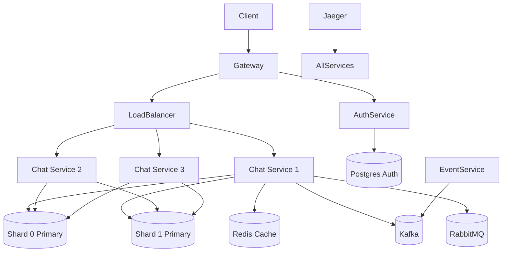

# NexusChat

[](https://github.com/your-org/nexuschat)
[](https://www.python.org/)
[](https://docs.docker.com/compose/)

A distributed chat platform built to study distributed systems concepts in practice — load balancing, sharding, replication, event-driven messaging, circuit breakers, distributed tracing, and observability.

---

## Quick Start

**Prerequisites:** [Docker Desktop](https://www.docker.com/products/docker-desktop/), [WSL2](https://learn.microsoft.com/en-us/windows/wsl/install) (Windows), Python 3.11+

```bash
docker compose up -d
```

Once all services are healthy, open [http://localhost:8080](http://localhost:8080) and register a user.

---

## Architecture



---

## Features

| Phase | Features |
|-------|----------|
| 0 | Project skeleton, Docker Compose baseline, `/health` endpoints |
| 1 | MVP chat with Postgres, JWT auth, REST + WebSocket real-time messaging |
| 2 | Service split (auth, chat, gateway), gRPC internal calls, rate limiting |
| 3 | Load balancing (9 algorithms), consistent hashing, Postgres sharding (2 shards + replicas), Redis caching |
| 4 | Kafka event streaming, RabbitMQ fan-out broadcast across replicas |
| 5 | Jaeger/OpenTelemetry distributed tracing, structured JSON logging |
| 6 | Flash-sale shop with overselling protection, WebSocket session resumption, simplified E2EE |

---

## Port Reference

| Service | Port | Protocol |
|---------|------|----------|
| Gateway | `8080` | HTTP / WebSocket |
| Load Balancer | `8000` | HTTP / WebSocket |
| Chat Service (×3) | `8000` | HTTP / WebSocket |
| Chat Service (gRPC) | `50051–50053` | gRPC |
| Auth Service | `8000` | HTTP |
| Event Service | `8000` | HTTP |
| Postgres Auth | `5432` | PostgreSQL |
| Shard 0 Primary | `5433` | PostgreSQL |
| Shard 0 Replica | `5434` | PostgreSQL |
| Shard 1 Primary | `5435` | PostgreSQL |
| Shard 1 Replica | `5436` | PostgreSQL |
| Kafka | `9092` | TCP |
| RabbitMQ | `5672` | AMQP |
| RabbitMQ Admin | `15672` | HTTP |
| Redis | `6379` | TCP |
| Jaeger UI | `16686` | HTTP |

---

## Phase Roadmap

- **Phase 0:** Skeleton & Compose Baseline
- **Phase 1:** MVP — One Service, One DB, Real Chat
- **Phase 2:** Service Split, gRPC, API Gateway
- **Phase 3:** Load Balancing, Sharding, Replication, Caching
- **Phase 4:** Consensus & Coordination (Raft, Gossip, HLC)
- **Phase 5:** Reliability (Circuit Breaker, Retry, Idempotency, Outbox) & Observability (Jaeger)
- **Phase 6:** Flash-Sale Shop, Kafka Events, RabbitMQ Broadcast, WebSocket Session Resumption, E2EE
