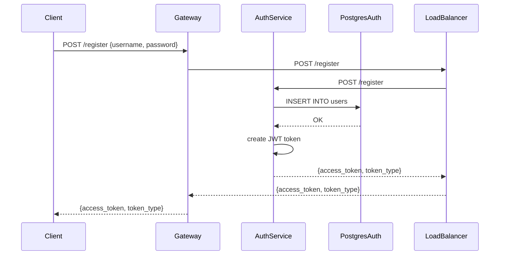
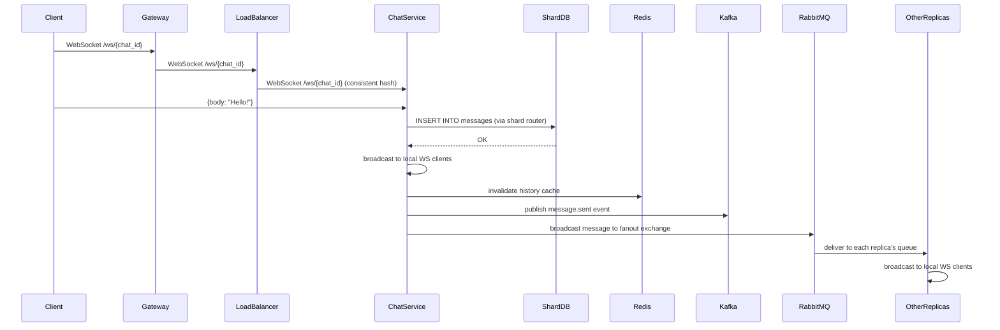

# Architecture

## Service Interaction Patterns

NexusChat uses five communication patterns, each chosen for a specific purpose:

| Pattern | Transport | Usage |
|---------|-----------|-------|
| **REST (sync)** | HTTP/1.1 | Public API — gateway exposes REST endpoints consumed by browsers/mobile. Auth registration/login are also REST. |
| **WebSocket (real-time)** | WebSocket | Bidirectional message delivery — clients connect via WS to send/receive chat messages in real time. |
| **gRPC (internal)** | HTTP/2 + Protobuf | Internal service-to-service calls — gateway proxies REST → gRPC to chat-service for CreateChat, GetHistory etc. |
| **Kafka (async events)** | TCP | Durable event log — every message.sent / chat.created event is published to Kafka for replay, analytics, and event sourcing. |
| **RabbitMQ (broadcast)** | AMQP | Cross-replica fan-out — when a message is received by one chat-service replica, it broadcasts to all other replicas via RabbitMQ fanout exchange so local WebSocket clients receive it. |

### Request Flow

```
Client → Gateway (REST/WS) → Load Balancer → Chat Service (REST/WS)
                                         ↘ Chat Service (gRPC) → Shard DB
                                         → Kafka (async)
                                         → RabbitMQ (broadcast)
```

---

## Sharding Strategy

Chat data is distributed across **2 Postgres shards** using MD5 consistent hashing:

```
shard_id = int(md5(chat_id.encode()).hexdigest(), 16) % 2
```

- Each shard has a **primary** (writes) and a **replica** (reads).
- Read replicas allow scaling read throughput and provide failover targets.
- Writes always go to the primary; reads prefer the replica.
- Cache-aside pattern: Redis caches history queries (`history:{chat_id}:{page}`) with 300s TTL and LRU eviction.

```
Shard 0 Primary (port 5433) ←→ Shard 0 Replica (port 5434)  [streaming replication]
Shard 1 Primary (port 5435) ←→ Shard 1 Replica (port 5436)  [streaming replication]
```

---

## Load Balancing Algorithms

The load balancer supports 9 algorithms, switchable at runtime via API:

| Key | Algorithm | Strategy |
|-----|-----------|----------|
| `rr` | Round-Robin | Cyclic distribution across backends |
| `wrr` | Weighted Round-Robin | Proportional by capacity (weights 3:2:1) |
| `sticky` | Sticky Session | Session affinity with 5-minute TTL |
| `hash` | Consistent Hashing | Deterministic by chat_id (50 virtual nodes per backend) |
| `lc` | Least Connections | Minimum active connections |
| `p2c` | Power of Two Choices | Sample 2, pick least loaded (O(1)) |
| `lrt` | Least Response Time | Lowest exponentially-smoothed avg latency |
| `ra` | Resource Aware | Lowest simulated CPU usage |
| `adaptive` | Adaptive Feedback | Dynamic weights from error_rate + latency |

Each backend has a **circuit breaker** (3-failure threshold, 30s recovery timeout). The **retry policy** uses exponential backoff with jitter (base 50ms, 2 retries max).

---

## Event-Driven Architecture

### Kafka Topics

| Topic | Partitions | Events |
|-------|-----------|--------|
| `chat.messages` | 1 (per chat_id hash) | `message.sent` |
| `chat.events` | 1 | `chat.created`, `chat.joined` |

### Event Schema

```json
{
  "event_type": "message.sent",
  "version": 1,
  "timestamp": "2026-06-24T12:00:00+00:00",
  "payload": {
    "id": "uuid",
    "chat_id": "uuid",
    "sender_id": "uuid",
    "sender_username": "alice",
    "body": "Hello!",
    "sent_at": "2026-06-24T12:00:00+00:00"
  }
}
```

### RabbitMQ

- **Exchange:** `nexuschat.fanout` (type: fanout, durable)
- **Queue per replica:** `nexuschat.replica.{grpc_port}` (durable, auto-delete)
- Messages are published with `DeliveryMode.PERSISTENT`.

---

## Observability

### Distributed Tracing

All services export OpenTelemetry spans via OTLP/HTTP to **Jaeger** at `jaeger:4318`.

| Service | Instrumentation |
|---------|----------------|
| Gateway | FastAPI, HTTPX |
| Load Balancer | FastAPI, HTTPX |
| Auth Service | FastAPI, SQLAlchemy |
| Chat Service | FastAPI, gRPC server, SQLAlchemy, Redis, aio-pika |
| Event Service | FastAPI |

### Structured Logging

Every service outputs structured JSON logs with trace context:

```json
{
  "asctime": "2026-06-24T12:00:00",
  "levelname": "INFO",
  "name": "chat-service",
  "message": "WS connected to chat abc-123",
  "trace_id": "0xabc123",
  "span_id": "0xdef456"
}
```

---

## Sequence Diagrams

### User Registration



### Message Send Flow


